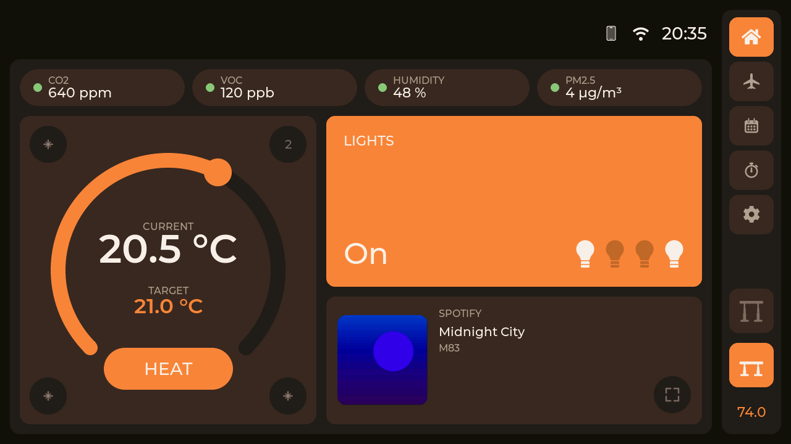
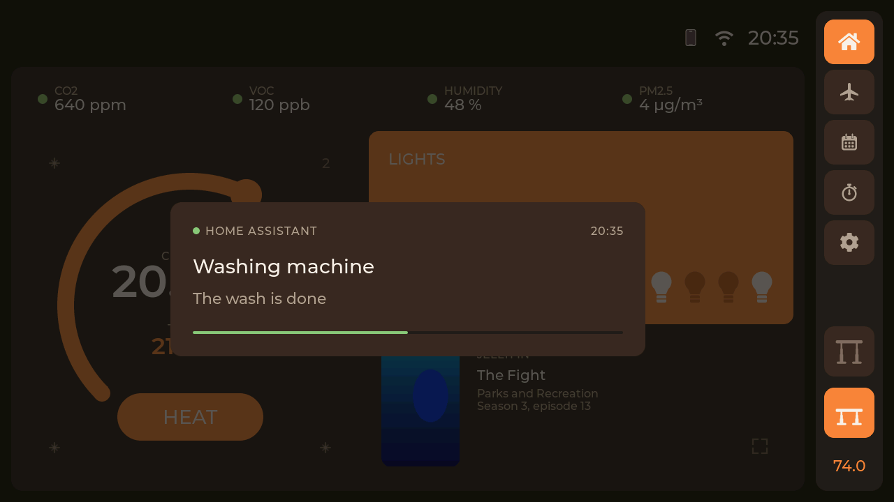

<h1 align="center">Smart Flexispot</h1>

<p align="center">
  A room controller that took the place of my standing desk's keypad.
</p>

<p align="center">
  <a href="https://github.com/wtb04/smart-flexispot/actions/workflows/ci.yml"></a>
  
  
  
</p>

<p align="center">
  <a href="#a-tour">A tour</a> |
  <a href="#getting-started">Getting started</a> |
  <a href="#try-it-without-the-hardware">Simulator</a> |
  <a href="docs/how-it-works.md">How it works</a> |
  <a href="CHANGELOG.md">Changelog</a>
</p>


Smart Flexispot is firmware for an [M5Stack Tab5](https://docs.m5stack.com/en/core/Tab5) that sits on my desk and drives the Flexispot under it. It replaces the desk's own keypad and controls the room from there: the lights and the heating through Home Assistant, and the desk itself. Along the way it also picked up what is playing on Jellyfin, my timetable with when to leave for it, the planes going over, and a focus timer.

> [!NOTE]
> **This is a showcase, not a product.** It is built around my desk, my room, my Home Assistant, my calendars and my phone, so a lot of it only makes sense in my setup. Treat it as a demo of what a desk panel can do and take whatever ideas or pieces are useful. Getting it running for yourself will mean changing things.

> [!NOTE]
> **Built with AI.** I came up with what it should do and it runs on my desk every day, but most of the code was written with the help of AI rather than by hand. For something this big, that is what made it a project of weeks instead of months. Read the code with that in mind.

I am not affiliated with Flexispot, LoctekMotion or M5Stack.

## Highlights

- **The room.** The lights, the heating and the air from Home Assistant, and the panel itself shows up in Home Assistant over MQTT.
- **The desk.** Height, Stand and Sit, six presets instead of the control box's four, over a cable or over Bluetooth.
- **Films and series.** Follows what plays on Jellyfin, with a cinema view that has the lights and the desk within reach.
- **Planes overhead.** A live radar with who is flying, where to, their photo and their trail.
- **The day.** The next lecture, a countdown, and when to leave to get there on time.
- **Focus timer**, a **presence sensor** from your phone, and **diagnostics** for every part, on the panel itself.
- **A simulator** that runs the real UI on a Mac, and host tests with coverage in CI.

## Why

I wanted one place to control my room from, mostly the lights and the heating. The spot where the desk's keypad sat, right at the edge of the desk, turned out to be the perfect place for it. Then I found [LoctekMotion_IoT](https://github.com/iMicknl/LoctekMotion_IoT), which works out what the control box and its keypad say to each other, so I could build my own controller and replace the keypad entirely.

Once the screen was there, the extra features kept coming, each one making it a bit more useful: what is playing, when to leave for the next lecture, what that plane is, a timer for focusing.

## A tour

### The home page



This is what the panel shows most of the day. The dock at the right is on every page: the pages, Home, Radar, Calendar, Focus and Setup, and at its foot Stand and Sit with the desk's height under them. Along the top are the time, whether my phone and Wi-Fi are there, the battery while it is unplugged, and the focus timer while it runs, the same row the fullscreen views have.

The rest is the room. The air across the top, each reading with a dot for how it is doing. The thermostat as a dial to turn, with its mode below. The lights, all of them with a tap, or hold for a picker of each light. And what is playing, the speaker's music here, or a Jellyfin episode as in the picture at the top.

### The room

It is built Home Assistant first. The panel talks to no light or thermostat itself: everything on the home page is one of Home Assistant's own entities, and every tap goes back to Home Assistant over its websocket.

It works the other way round too. The panel shows up in Home Assistant as a device of its own over MQTT, with the desk's controls, its sensors and its diagnostics, so automations can move the desk, turn the screen off or put a message on it.

| In Home Assistant | Entities |
|---|---|
| Controls | Up, Down, Stop, Preset 1 to 6, Screen |
| Sensors | Height, Active preset, Motion, Presence |
| Notifications | Screen message |
| Configuration | Brightness |
| Diagnostics | Battery, its voltage, current and power, Charging, External power, Desk link, Presence signal, Signal, Uptime, Last update |

### Notices



Anything in Home Assistant can put a message on the screen through the panel's *Screen message* entity: the washing machine that is done, a door left open. It slides in over whatever is showing, fullscreen views included, and goes after a while or when tapped.

### The desk

Stand and Sit are always in the dock, with the height as the control box reports it under them. Tap the height and the rest of the desk folds out: the height in big digits as its own display shows it, every preset, and up and down to hold. Tap a preset to go there, tap it again to stop, hold it to save the current height.

- **Six presets instead of four.** The control box has four of its own. The panel drives the desk to the other two itself, and learns how far the desk rolls on after the keys are let go, so it stops where you asked.
- **No cable across the room, if you want.** The desk can be wired straight to the Tab5, or to a small ESP32 left at the desk that the panel talks to over Bluetooth (see [option 2](#option-2-over-bluetooth-with-a-companion)).
- **Safe by default.** A key that stops changing the height is let go of, a move from Home Assistant stops unless it keeps being asked for, and the byte that would factory-reset the control box is pinned by a test.

### Films and series


When something plays on Jellyfin the media card follows it, and holding the card sends the desk to its viewing height. The cinema view has the episode's still, when it ends, skip intro, next episode, subtitles, volume, and the lights and the desk within reach. Players that cannot be controlled from elsewhere (the Streamyfin app, for one) are still followed, their buttons just fade out.

### Planes overhead

| Radar | Fullscreen |
|---|---|
|  |  |

This one is purely because it's fun. A radar of everything flying within 20 to 160 km, on a map of the coast and the borders, each plane coloured by its height. Tap one to see the airline, the aircraft, the route and a photo, and its trail draws itself back along where it has been. The pictures above are over Schiphol.

Positions come from [adsb.lol](https://adsb.lol) and [adsb.fi](https://adsb.fi), aircraft and routes from [adsbdb](https://www.adsbdb.com), photos from [Planespotters](https://www.planespotters.net).

### The day


The calendar page reads iCal feeds, mine come from [CalendarChanger](https://github.com/wtb04/CalendarChanger), and puts the next thing up top with a countdown. With a journey planner set up it also tells you when to leave: every leg by bike, train, bus or on foot, with delays and cancellations as they come in.

### Focus

| Focus | Fullscreen |
|---|---|
|  |  |

A focus timer in rounds, 25 minutes on and 5 off by default with a long break after four. The countdown stays on the tab in the nav bar on every page, and if the panel restarts halfway through a round it picks it up where it should be.

### Away from the desk

The panel knows my phone over Bluetooth, by its identity key, and the phone in the top row shows whether it is there. While it is away, Radar, Calendar and Focus are hidden, leaving Home and Setup, and presets 5 and 6 show for whoever uses the desk then. *Pages while away* in Setup turns that off.

The screen can be switched off from Home Assistant, and a tap wakes it. While it is dark, the panel fetches nothing that only the screen would show. With Orientation on Auto, turning the panel upside down turns the picture with it.

### Setup and diagnostics

| Setup | Diagnostics |
|---|---|
|  |  |

Brightness, accent colour, which side the dock is on, the focus lengths. Diagnostics has a card for every part (Wi-Fi, Home Assistant, the desk and its link, the battery, the radar, the calendar) and a log you can filter, so when something is off you can see why without a laptop.

## Will it work with my desk?

Probably, if the control box speaks the HS01B / HS13B dialect, which most LoctekMotion boxes (and so most Flexispots) do. The HCB2xx series does not.

The protocol and pinouts come from [iMicknl/LoctekMotion_IoT](https://github.com/iMicknl/LoctekMotion_IoT), which did the hard work of figuring out what the control box says. If your box is not covered there, it will not work here either.

## Getting started

### 1. Get the hardware

- An M5Stack Tab5. Early units have an ESP32-P4 v1.x chip, which `sdkconfig.defaults` targets. Check yours with `esptool.py --port <port> chip_id`. Both display revisions (ILI9881C and ST7123) work.
- A Flexispot with a supported control box (see above) and an RJ45 cable you do not mind cutting.
- Optionally, any ESP32 as the companion.

### 2. Connect the desk

There are two ways to reach the control box. Either the Tab5 is wired to it directly, or a small ESP32 stays at the desk on the wire and the Tab5 talks to that over Bluetooth, so the panel can go anywhere in the room on its battery.

<picture>
  <source media="(prefers-color-scheme: dark)" srcset="docs/diagrams/overview-dark.svg">
  
</picture>

> [!WARNING]
> **The control box talks at 5 V and the Tab5's pins are 3.3 V**, with no level shifter anywhere on the M5-Bus ([measured here](https://github.com/iMicknl/LoctekMotion_IoT/issues/34)). People wire it directly and it works for them, but it is out of spec. A level shifter, or at least a series resistor on RX and the wake line, is cheap insurance.

#### Option 1: a cable to the Tab5

<picture>
  <source media="(prefers-color-scheme: dark)" srcset="docs/diagrams/wiring-1-dark.svg">
  
</picture>

#### Option 2: over Bluetooth, with a companion

The companion is an ESP32 DevKit V1 (30-pin) on a small carrier board of my own with an RJ45 jack. The board takes its power from the desk, shifts the box's 5 V signal down to 3.3 V for the ESP32, and lights the two LEDs in the jack for Bluetooth (`BT`) and the desk link (`LINK`).

| Top | Bottom |
|---|---|
|  |  |


<picture>
  <source media="(prefers-color-scheme: dark)" srcset="docs/diagrams/wiring-2-dark.svg">
  
</picture>

The two LEDs in the jack say how the companion is doing, so you can tell at a glance without a laptop:

| LED | Solid | Blinking | Off |
|---|---|---|---|
| `BT`, yellow | the panel is connected | a short blink every 2 s: running, waiting for the panel | not running |
| `LINK`, green | the control box answers | fast: bytes arrive but nothing decodes, so a wiring or baud fault | the box is silent |

At start-up each LED blinks twice on its own and then both light together, which shows both work.

<details>
<summary>The schematic</summary>


</details>

Everything to have it made is in [pcb/](pcb/): the KiCad project, the [schematic as a PDF](pcb/fab/tab5-desk-ctrl-schematic.pdf), and the gerbers, BOM and placement files for JLCPCB.

Flash `proxy/` onto the DevKit with `cd proxy && idf.py build flash monitor`. Its defaults are for the breadboard it was first built on, which had TX and RX the other way round, so for the board set `CONFIG_LOCTEK_TX_GPIO=17` and `CONFIG_LOCTEK_RX_GPIO=16` under `idf.py menuconfig`, *Loctek desk control*.

### 3. Install ESP-IDF

```sh
brew install cmake ninja dfu-util python3
mkdir -p ~/esp && cd ~/esp
git clone -b v5.5.5 --recursive https://github.com/espressif/esp-idf.git
cd esp-idf && ./install.sh esp32p4 esp32
. ~/esp/esp-idf/export.sh     # in every new shell
```

`esp32` is only needed for the companion.

### 4. Fill in your secrets

Everything the panel talks to has a `*_secrets.example.h` template next to where its real one goes. Copy each to `*_secrets.h` in the same folder and fill in what you have. Anything left empty is just not started, so the desk alone works with no secrets at all.

| File | What goes in it |
|---|---|
| `components/wifi/include/wifi_secrets.h` | Your Wi-Fi |
| `components/hass/include/hass_secrets.h` | Home Assistant's address and a token, and the MQTT broker |
| `components/jellyfin/include/jellyfin_secrets.h` | The Jellyfin server and an API key |
| `components/ical/include/ical_secrets.h` | Your calendar feeds |
| `components/travel/include/travel_secrets.h` | The journey planner and its key |
| `components/ble/include/ble_secrets.h` | Your phone's Bluetooth identity key, for presence |
| `components/ota/include/ota_secrets.h` | A key for updates over Wi-Fi |

### 5. Flash it

Plug the Tab5 in over USB-C and:

```sh
idf.py build
idf.py -p /dev/cu.usbmodem* flash monitor
```

Ctrl-] leaves the monitor. If the port does not show up, hold BOOT while plugging in.

It boots into a splash that shows the desk, the network and Home Assistant coming up, and is on the home page in about ten seconds.

Every CI run also keeps a `smart_flexispot-full.bin` that can be written at 0x0 without building anything:

```sh
esptool.py --chip esp32p4 -p /dev/cu.usbmodem* write_flash 0x0 smart_flexispot-full.bin
```

Those are built from the templates though, so they have no network: enough to try the screen and the desk, not the rest.

### 6. Update over Wi-Fi

After the first cable flash, neither board needs the cable again:

```sh
tools/ota.sh panel            # the panel, over Wi-Fi
tools/ota.sh companion        # the companion, passed on by the panel over Bluetooth
tools/ota.sh both             # both, companion first
tools/ota.sh panel --now      # install right away instead of when you tap Update now
```

An update waits on the Setup page until you tap it, and is refused while the desk moves. A new firmware is on trial until it gets back on Wi-Fi. If it does not within three minutes, the panel goes back to the version before and tells you so.

## Try it without the hardware

The simulator runs the panel's own UI in a window on your Mac, with the desk, Home Assistant and Jellyfin played by stubs you drive from the keyboard:

```sh
sim/run.sh
```

The calendar, journey and radar are real, and those are the only things it is allowed to reach, so it can never move a real desk or turn off your lights. All screenshots here are from it. See [sim/README.md](sim/README.md) for the keys.

## How it works

How the panel is put together inside, the desk protocol, and how to run the tests, the simulator and the development build are in [docs/how-it-works.md](docs/how-it-works.md).

## Credits

- [iMicknl/LoctekMotion_IoT](https://github.com/iMicknl/LoctekMotion_IoT) for working out the control box protocol and pinouts. This project would not exist without it.
- [adsb.lol](https://adsb.lol), [adsb.fi](https://adsb.fi), [adsbdb](https://www.adsbdb.com) and [Planespotters](https://www.planespotters.net) for the planes, and the photographers for their photos.
- [Natural Earth](https://www.naturalearthdata.com) for the map.

Made by [Wouter ten Brinke](https://woutertenbrinke.nl).
