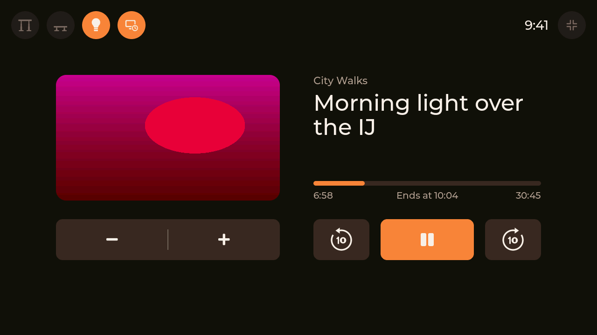
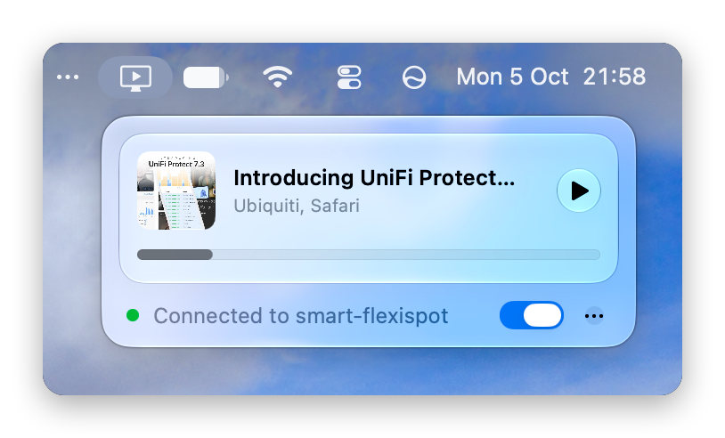
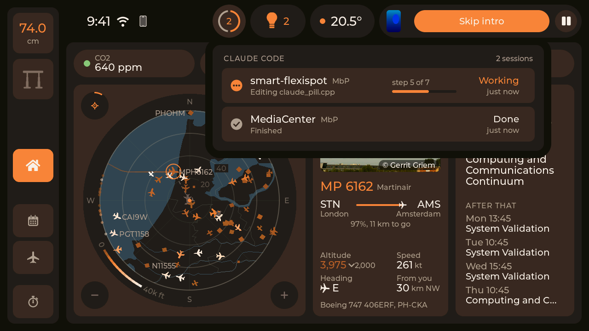
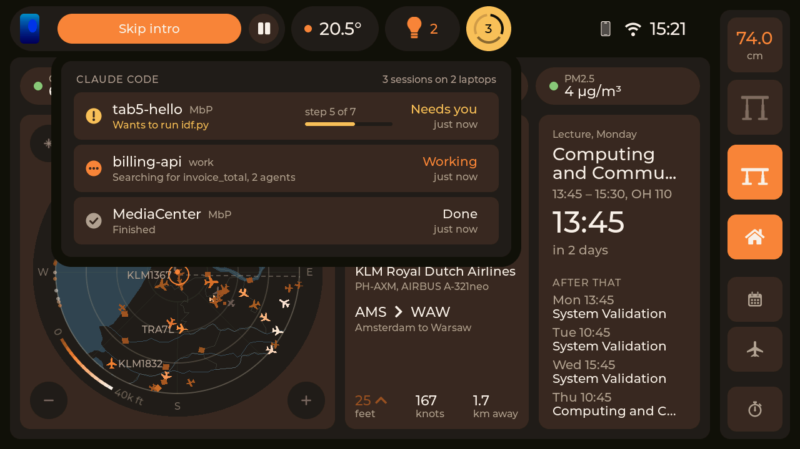

<h1 align="center">Smart Flexispot</h1>

<p align="center">
  A room controller that took the place of my standing desk's keypad.
</p>

<p align="center">
  <a href="https://github.com/wtb04/smart-flexispot/actions/workflows/ci.yml"></a>
  
  
  
</p>

<p align="center">
  <a href="#a-tour">A tour</a> |
  <a href="docs/getting-started.md">Getting started</a> |
  <a href="#try-it-without-the-hardware">Simulator</a> |
  <a href="docs/how-it-works.md">How it works</a> |
  <a href="CHANGELOG.md">Changelog</a>
</p>


Smart Flexispot is firmware for an [M5Stack Tab5](https://docs.m5stack.com/en/core/Tab5) that sits on my desk and drives the Flexispot under it. It replaces the desk's own keypad and controls the room from there: the lights and the heating through Home Assistant, and the desk itself. Along the way it also picked up what is playing on Jellyfin, my timetable with when to leave for it, the planes going over, and a focus timer.

> [!NOTE]
> **This is a showcase, not a product.** It is built around my desk, my room, my Home Assistant, my calendars and my phone, so a lot of it only makes sense in my setup. Treat it as a demo of what a desk panel can do and take whatever ideas or pieces are useful. Getting it running for yourself will mean changing things.

> [!NOTE]
> **Built with AI.** Most of the code was written with AI rather than by hand, so this is not so much a showcase of my coding skills (if those still count for much nowadays) as of how I think using something like this should feel. It is also just a fun project for myself, and building it this way made it a matter of weeks instead of months.

Issues are welcome; for pull requests, expect slow answers, as this is a project for my own desk.

I am not affiliated with, or endorsed by, any of the products or services named here: Flexispot, LoctekMotion, M5Stack, Espressif, Home Assistant, Jellyfin, Anthropic, Planespotters or the flight data sites. Their names are trademarks of their owners.

## Highlights

- **The room.** The lights, the heating and the air from Home Assistant, and the panel itself shows up in Home Assistant over MQTT.
- **The desk.** Height, Stand and Sit, six presets instead of the control box's four, over a cable or over Bluetooth.
- **Films and series.** Follows what plays on Jellyfin, with a cinema view that has the lights and the desk within reach.
- **Planes overhead.** A live radar with who is flying, where to, their photo and their trail.
- **The day.** The next lecture, a countdown, and when to leave to get there on time.
- **Desk Link**, a menu bar app that connects my Mac to the panel: what plays there shows on the panel and is steered from it, and Claude Code's sessions come through it.
- **Claude Code** on the laptops: a pill in the control bar while a session works, amber when one waits on you.
- **Focus timer**, a **presence sensor** from your phone, and **diagnostics** for every part, on the panel itself.
- **A simulator** that runs the real UI on a Mac, and host tests with coverage in CI.

## Why

I wanted one place to control my room from, mostly the lights and the heating. The spot where the desk's keypad sat, right at the edge of the desk, turned out to be the perfect place for it. Then I found [LoctekMotion_IoT](https://github.com/iMicknl/LoctekMotion_IoT), which works out what the control box and its keypad say to each other, so I could build my own controller and replace the keypad entirely.

Once the screen was there, the extra features kept coming, each one making it a bit more useful: what is playing, when to leave for the next lecture, what that plane is, a timer for focusing.

## A tour

### The home page


What the panel shows most of the day. The dock at the side holds the desk: its height, one button for Stand and Sit, Home in the middle, and from its foot the focus timer, Radar and Calendar. The control bar along the top holds what gets touched every day: what is playing, the heating, the lights and the status, each dropping a card when tapped. Home itself is for looking at: the air, the sky overhead and what comes next.

### The room


It is built Home Assistant first: every light and thermostat is one of its entities, and every tap goes back to it. The other way round, the panel is a device in Home Assistant over MQTT, so automations can move the desk, turn the screen off or put a message on it, such as the washing machine being done.

### The desk

One button goes between Stand and Sit, showing which way while the desk moves, and a tap on the height folds out up, down and the other presets. There are six presets instead of the control box's four, the desk is [wired straight to the Tab5 or reached over Bluetooth](#connecting-the-desk), and it is safe by default: a move from Home Assistant stops unless it keeps being asked for, and the byte that would factory-reset the box is pinned by a test.

### Films and series


When something plays on Jellyfin the control bar follows it, and holding it there sends the desk to its viewing height. The cinema view has the episode's still, when it ends, skip intro, next episode, ten seconds back and on, subtitles and volume, with the lights and the desk within reach. A swipe across the picture goes to the episode before or after. Only what the player playing would act on is shown.

### The laptop



[Desk Link](desklink/), a small menu bar app on my Mac, connects the laptop to the panel. Whatever plays on the Mac shows on the panel with its cover, a video in the cinema view and music on the media card, and the panel's buttons pause, seek, skip and change the volume there. Claude Code's sessions come through it too. Jellyfin comes first, then the speaker, then the laptop. Everything the two send each other is encrypted with a key they share, and each regularly checks that the other is still there.

<p align="center"><picture><source media="(prefers-color-scheme: dark)" srcset="desklink/shots/menu-dark.png"></picture></p>

### Planes overhead

| On Home | The radar page |
|---|---|
|  |  |

Purely because it's fun: everything flying within 20 to 160 km on a map of the coast, each plane coloured by its height, with its airline, route, photo and trail. Left alone it follows the most notable aircraft in view, an A380 over a 737, taking turns every few minutes. Positions come from [adsb.lol](https://adsb.lol) and [adsb.fi](https://adsb.fi), aircraft and routes from [adsbdb](https://www.adsbdb.com) and [hexdb.io](https://hexdb.io), photos from [Planespotters](https://www.planespotters.net). adsb.fi's data is for personal, non-commercial use only, and so is anything built on it here.

### The day


The next thing on my iCal feeds (mine come from [CalendarChanger](https://github.com/wtb04/CalendarChanger)) with a countdown, and with a journey planner, when to leave: every leg by bike, train, bus or on foot, with delays as they come in.

### Focus

| Focus | Fullscreen |
|---|---|
|  |  |

A focus timer in rounds, 25 minutes on and 5 off by default, from its button at the dock's foot, and fullscreen from there.

### Claude Code

| Working | Waiting on you |
|---|---|
|  |  |

While a Claude Code session on one of my laptops works, a pill in the control bar shows it, turning amber with a chime when one waits for me to allow something; tapped, it shows each session's project, steps and what it did last. The laptops tell the panel through Claude Code's hooks and Desk Link, sealed, and only names leave them, never a prompt, a reply or a file's contents.

### Away from the desk

The panel knows my phone over Bluetooth. While it is away, the personal pages are hidden and the extra presets show for whoever uses the desk then. While the screen is off, the panel fetches nothing that only the screen would show.

### Setup and diagnostics

| Setup | Diagnostics |
|---|---|
|  |  |

Brightness, accent colour, which side the dock is on, the focus lengths, and a card for every part with a log, so when something is off you can see why without a laptop.

## Will it work with my desk?

Probably, if the control box speaks the HS01B / HS13B dialect, which most LoctekMotion boxes (and so most Flexispots) do. The HCB2xx series does not.

The protocol and pinouts come from [iMicknl/LoctekMotion_IoT](https://github.com/iMicknl/LoctekMotion_IoT), which did the hard work of figuring out what the control box says. If your box is not covered there, it will not work here either.

## Connecting the desk

<picture>
  <source media="(prefers-color-scheme: dark)" srcset="docs/diagrams/overview-dark.svg">
  
</picture>

The panel takes the keypad's place on the control box's RJ45 line, in one of two ways:

- **A cable to the Tab5.** Four wires from the line to the Tab5's M5-Bus, and nothing else to build. The panel stays where the cable reaches.
- **Over Bluetooth, with a companion.** A small ESP32 stays on the line at the desk and the panel talks to it, so the panel can go anywhere in the room on its battery, and updates the companion over the air too.

The companion is an ESP32 DevKit on a carrier board of my own: powered by the desk, shifting the box's 5 V signal down for the ESP32, with two LEDs in its RJ45 jack for the Bluetooth and desk links.

| Top | Bottom |
|---|---|
|  |  |


The KiCad project and everything to have it made are in [pcb/](pcb/), and the wiring for both ways in [getting started](docs/getting-started.md#2-connect-the-desk).

## Getting started

The hardware, wiring the desk directly or through the companion, ESP-IDF, the secrets, flashing and updating over Wi-Fi, and connecting Claude Code on your laptops are all in [docs/getting-started.md](docs/getting-started.md).

## Try it without the hardware

The simulator runs the panel's own UI in a window on your Mac, with the desk, Home Assistant and Jellyfin played by stubs you drive from the keyboard:

```sh
sim/run.sh
```

The calendar, journey and radar are real, and those are the only things it is allowed to reach, so it can never move a real desk or turn off your lights. All screenshots here are from it. See [sim/README.md](sim/README.md) for the keys.

## How it works

How the panel is put together inside, the desk protocol, and how to run the tests, the simulator and the development build are in [docs/how-it-works.md](docs/how-it-works.md).

## Credits

- [iMicknl/LoctekMotion_IoT](https://github.com/iMicknl/LoctekMotion_IoT) for working out the control box protocol and pinouts. This project would not exist without it.
- [adsb.lol](https://adsb.lol), [adsb.fi](https://adsb.fi), [adsbdb](https://www.adsbdb.com), [hexdb.io](https://hexdb.io) and [Planespotters](https://www.planespotters.net) for the planes, and the photographers for their photos.
- [Natural Earth](https://www.naturalearthdata.com) for the map.
- [ungive/mediaremote-adapter](https://github.com/ungive/mediaremote-adapter), through which Desk Link reads macOS's Now Playing.

## Licence

Copyright 2026 Wouter ten Brinke. The code, the documents and the board are under the Apache License 2.0, see [LICENSE](LICENSE) and [NOTICE](NOTICE). What comes from others keeps its own licence, listed in [THIRD_PARTY_NOTICES.md](THIRD_PARTY_NOTICES.md); the aircraft photos in the screenshots are their photographers'.

Made by [Wouter ten Brinke](https://woutertenbrinke.nl), with a [write-up of the project](https://woutertenbrinke.nl/projects/smart-flexispot) on my site.
