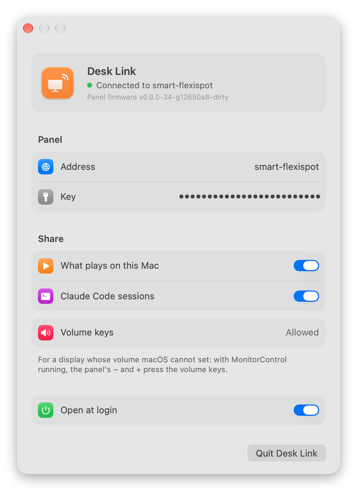

# Desk Link

<picture><source media="(prefers-color-scheme: dark)" srcset="shots/menu-dark.png"></picture>

A menu bar app that connects this Mac to the desk panel. Whatever plays on the
Mac, from any app that shows under Now Playing, appears on the panel with its
cover and where it is, and the panel's buttons pause, seek, skip and change the
volume here. Claude Code's sessions on this Mac reach the panel through it too.

The menu shows what plays, with a button to pause it, and whether the panel
answers; the switch beside that turns sharing off and on, and the menu behind
the dots opens the settings.

## Settings

<picture><source media="(prefers-color-scheme: dark)" srcset="shots/settings-dark.png"></picture>

The panel's address and the key the two share, what this Mac shares with it,
the volume keys for a display whose volume macOS cannot set, and whether Desk
Link opens at login.

## Build

From the repository's root:

    git submodule update --init
    cd desklink && make install   # builds, copies to /Applications and starts it

Needs macOS 26, Xcode's command line tools and CMake. It is signed with the
first Apple Development identity there is, so the keychain trusts each new
build as the same app. The key is the panel's `DESK_LINK_KEY`, from
`components/laptop/include/desk_link_secrets.h`; type it in the menu, or hand
it over before the first start:

    defaults write nl.w-tb.desklink key <DESK_LINK_KEY>

and Desk Link moves it into the login keychain.

## How it talks to the panel

Every message, each way, is sealed with AES-256-GCM under that key, as the
panel's `components/laptop/include/link_envelope.h` describes, and carries
when it was sent, so one that is stale or seen before is refused. Desk Link
tells the panel's `/link` how it is whenever what plays changes and every ten
seconds whatever it is; the panel answers with a pong, and pings port 47801
here to say whether it reaches the Mac back. The panel sends its commands to
`/link` here and asks `/cover` for the picture. tools/claude-hook hands its
events to `/claude` here, which only this Mac may reach, and Desk Link passes
them on. The messages are in `components/laptop/include/laptop_protocol.h`.

Since macOS 15.4 Apple only lets its own apps read Now Playing; Desk Link reads
it through [mediaremote-adapter](https://github.com/ungive/mediaremote-adapter),
which runs it under `/usr/bin/perl`.
