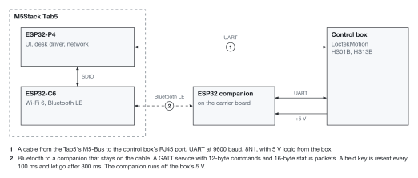
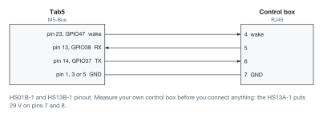
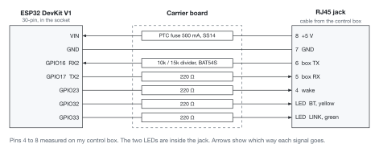

# Getting started

Everything to build the panel for your own desk, from the hardware to the first flash. What it does is in the [README](../README.md), and how it is put together inside in [how it works](how-it-works.md).

## 1. Get the hardware

- An M5Stack Tab5. Early units have an ESP32-P4 v1.x chip, which `sdkconfig.defaults` targets, and so do the release images. Check yours with `esptool.py --port <port> chip_id`. On a v3.x chip, take the two `ESP32P4_REV` lines out of `sdkconfig.defaults` and run `idf.py fullclean`; I have not tried that. Both display revisions (ILI9881C and ST7123) work.
- A Flexispot with a supported control box (see [Will it work with my desk?](../README.md#will-it-work-with-my-desk)) and an RJ45 cable you do not mind cutting.
- Optionally, any ESP32 as the companion.

## 2. Connect the desk

There are two ways to reach the control box. Either the Tab5 is wired to it directly, or a small ESP32 stays at the desk on the wire and the Tab5 talks to that over Bluetooth, so the panel can go anywhere in the room on its battery.

<picture>
  <source media="(prefers-color-scheme: dark)" srcset="diagrams/overview-dark.svg">
  
</picture>

> [!WARNING]
> **The control box talks at 5 V and the Tab5's pins are 3.3 V**, with no level shifter anywhere on the M5-Bus ([measured here](https://github.com/iMicknl/LoctekMotion_IoT/issues/34)). People wire it directly and it works for them, but it is out of spec. A level shifter, or at least a series resistor on RX and the wake line, is cheap insurance.

### Option 1: a cable to the Tab5

<picture>
  <source media="(prefers-color-scheme: dark)" srcset="diagrams/wiring-1-dark.svg">
  
</picture>

The panel starts out talking to a companion over Bluetooth. With the cable, set Setup, Behaviour, Desk link to **WIRE** once it is running.

### Option 2: over Bluetooth, with a companion

The companion is an ESP32 DevKit V1 (30-pin) on a small carrier board of my own with an RJ45 jack. The board takes its power from the desk, shifts the box's 5 V signal down to 3.3 V for the ESP32, and lights the two LEDs in the jack for Bluetooth (`BT`) and the desk link (`LINK`).

| Top | Bottom |
|---|---|
|  |  |


<picture>
  <source media="(prefers-color-scheme: dark)" srcset="diagrams/wiring-2-dark.svg">
  
</picture>

The two LEDs in the jack say how the companion is doing, so you can tell at a glance without a laptop:

| LED | Solid | Blinking | Off |
|---|---|---|---|
| `BT`, yellow | the panel is connected | a short blink every 2 s: running, waiting for the panel | not running |
| `LINK`, green | the control box answers | fast: bytes arrive but nothing decodes, so a wiring or baud fault | the box is silent |

At start-up each LED blinks twice on its own and then both light together, which shows both work.

<details>
<summary>The schematic</summary>


</details>

Everything to have it made is in [pcb/](../pcb/): the KiCad project, the [schematic as a PDF](../pcb/fab/tab5-desk-ctrl-schematic.pdf), and the gerbers, BOM and placement files for JLCPCB.

Flash `proxy/` onto the DevKit with `cd proxy && idf.py build flash monitor`. Its defaults are the board's. Wired by hand instead, check TX and RX under `idf.py menuconfig`, *Loctek desk control*.

## 3. Install ESP-IDF

```sh
brew install cmake ninja dfu-util python3
mkdir -p ~/esp && cd ~/esp
git clone -b v5.5.5 --recursive https://github.com/espressif/esp-idf.git
cd esp-idf && ./install.sh esp32p4 esp32
. ~/esp/esp-idf/export.sh     # in every new shell
```

`esp32` is only needed for the companion. Then get this repository; the steps after this one run from it:

```sh
git clone https://github.com/wtb04/smart-flexispot ~/smart-flexispot && cd ~/smart-flexispot
```

## 4. Fill in your secrets

Everything the panel talks to has a `*_secrets.example.h` template next to where its real one goes. Copy each to `*_secrets.h` in the same folder and fill in what you have. Anything left empty is just not started, so the desk alone works with no secrets at all.

Every one of them ends up as plain text in the firmware, in `build/` and on the panel's flash, where anyone holding the panel can read it over USB. So keep your build to yourself, and give Home Assistant and the MQTT broker users of their own with no more rights than the panel needs. For the update and Claude keys, something like `openssl rand -hex 16` makes a good one; they go over the network in plain HTTP, so they are only as private as your home network.

| File | What goes in it |
|---|---|
| `components/wifi/include/wifi_secrets.h` | Your Wi-Fi |
| `components/hass/include/hass_secrets.h` | Home Assistant's address and a token, and the MQTT broker |
| `components/jellyfin/include/jellyfin_secrets.h` | The Jellyfin server and an API key |
| `components/ical/include/ical_secrets.h` | Where your timetable's feeds are, and an Outlook calendar's link |
| `components/travel/include/travel_secrets.h` | A travel service and its key. Mine is a separate project that is not published; the panel asks it the way to the next event, in the format `components/travel/test/test_travel_parse.cpp` shows. Leave it empty and there is no route |
| `components/ble/include/ble_secrets.h` | Your phone's Bluetooth identity key, for presence |
| `components/ota/include/ota_secrets.h` | A key for updates over Wi-Fi |
| `components/laptop/include/desk_link_secrets.h` | The key a laptop's Desk Link seals what it tells the panel with, if you want a laptop's Now Playing and Claude Code sessions on it |

### Make it yours

A few things are mine in the code rather than secrets, and are worth a look before the first build:

- **Your Home Assistant entities.** Copy `components/room/room_config.example.h` to `room_config.h` beside it, which git ignores, and put in your readings, lights, thermostat and speaker. Without it the panel is built with the example's.
- **Your favourite playlists**, in the same file, for the music card's popup.
- **Your desk's height range**, in `idf.py menuconfig`, *Loctek desk control*: 660 to 1310 mm is mine.
- **Your time zone**, in `idf.py menuconfig`, *Panel time*. Central European Time is the default.
- **What the presets are called** on the screen: copy the list in `components/ui/ui_internal.h` to `components/ui/ui_presets.h`, which git ignores, and rename them there.
- **The radar's map** covers the Channel to Berlin, 48.5 to 56 N and 0.5 to 13 E. For your own part of the world, `tools/make_map.py --out components/radar/map_data.h --box <south> <west> <north> <east>` draws a new one from Natural Earth; keep the box modest, as every line on it costs memory to draw.

## 5. Flash it

Plug the Tab5 in over USB-C and:

```sh
idf.py build
idf.py -p /dev/cu.usbmodem* flash monitor
```

Ctrl-] leaves the monitor. If the port does not show up, hold BOOT while plugging in.

It boots into a splash that shows the desk, the network and Home Assistant coming up, and is on the home page in about ten seconds.

Every [release](https://github.com/wtb04/smart-flexispot/releases) has a `smart_flexispot-<version>-full.bin` that can be written at 0x0 without building anything:

```sh
esptool.py --chip esp32p4 -p /dev/cu.usbmodem* write_flash 0x0 smart_flexispot-v0.9.0-full.bin
```

Those are built from the empty templates, so they have no network: enough to try the screen and the desk, not the rest.

## 6. Update over Wi-Fi

After the first cable flash, neither board needs the cable again:

```sh
tools/ota.sh panel            # the panel, over Wi-Fi
tools/ota.sh companion        # the companion, passed on by the panel over Bluetooth
tools/ota.sh both             # both, companion first
tools/ota.sh panel --now      # install right away instead of when you tap Update now
```

An update waits on the Setup page until you tap it, and is refused while the desk moves. A new firmware is on trial until it gets back on Wi-Fi. If it does not within three minutes, the panel goes back to the version before and tells you so.

## 7. Desk Link on your Mac

Optional. [Desk Link](../desklink/) is a menu bar app that tells the panel what plays on the Mac and takes its play, pause, seek and volume back, and passes Claude Code's events on, every message sealed with the key in `desk_link_secrets.h`. It needs macOS 26, Xcode's command line tools and CMake:

```sh
git submodule update --init
cd desklink && make install
```

Then give it the key from its menu, under Panel, or before its first start with `defaults write nl.w-tb.desklink key <DESK_LINK_KEY>`, which it moves into the keychain. The menu says whether the panel answers, and whether the panel reaches the Mac back; a firewall that lets Desk Link out but keeps port 47801 shut stops the commands.

For Claude Code, each laptop also needs `jq` and `curl`, which macOS has, and this repository's `tools/claude-hook`. In `~/.claude/settings.json`, run it on every event that changes what the panel shows; `async` keeps Claude Code from ever waiting on it:

```json
{
  "hooks": {
    "SessionStart":      [{ "hooks": [{ "type": "command", "command": "~/smart-flexispot/tools/claude-hook", "async": true }] }],
    "UserPromptSubmit":  [{ "hooks": [{ "type": "command", "command": "~/smart-flexispot/tools/claude-hook", "async": true }] }],
    "PreToolUse":        [{ "hooks": [{ "type": "command", "command": "~/smart-flexispot/tools/claude-hook", "async": true }] }],
    "PostToolUse":       [{ "hooks": [{ "type": "command", "command": "~/smart-flexispot/tools/claude-hook", "async": true }] }],
    "PermissionRequest": [{ "hooks": [{ "type": "command", "command": "~/smart-flexispot/tools/claude-hook", "async": true }] }],
    "SubagentStart":     [{ "hooks": [{ "type": "command", "command": "~/smart-flexispot/tools/claude-hook", "async": true }] }],
    "SubagentStop":      [{ "hooks": [{ "type": "command", "command": "~/smart-flexispot/tools/claude-hook", "async": true }] }],
    "Stop":              [{ "hooks": [{ "type": "command", "command": "~/smart-flexispot/tools/claude-hook", "async": true }] }],
    "StopFailure":       [{ "hooks": [{ "type": "command", "command": "~/smart-flexispot/tools/claude-hook", "async": true }] }],
    "SessionEnd":        [{ "hooks": [{ "type": "command", "command": "~/smart-flexispot/tools/claude-hook", "async": true }] }]
  }
}
```

The hook hands each event to Desk Link on the laptop itself, and Desk Link seals it and passes it on, so nothing a network can read leaves the laptop. `CLAUDE_MACHINE` in `env` sets what the panel calls the laptop, its host name otherwise. Without Desk Link running, the events go nowhere.
